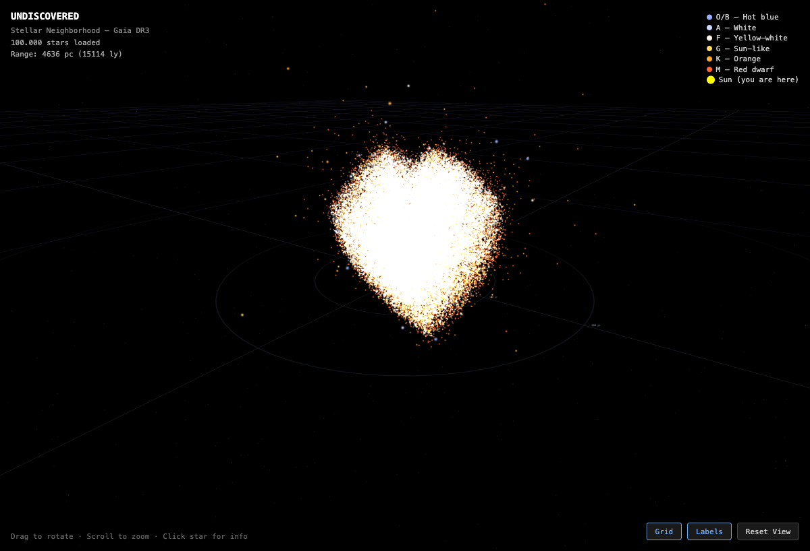

# Milky Way Visualization & Analysis Engine

A Rust-powered tool that fetches real star data from ESA's Gaia DR3 catalog (1.8 billion stars), renders an interactive 3D visualization in the browser, and runs high-performance spatial analysis — clustering, stellar stream detection, and density mapping.



## What it does

**3D Star Map** — Up to 10 million real stars rendered with WebGL. Color-coded by spectral type, with time-travel to simulate stellar motion across millennia. Click any star to see its distance, temperature, luminosity, and velocity.

**Analysis Engine** — Where Rust earns its keep:

| Operation | 500K stars | 10M stars |
|-----------|-----------|-----------|
| Load binary data | 0.02s | 0.58s |
| Build KD-tree | 0.14s | 6.5s |
| DBSCAN clustering | 1.5s | minutes |
| Density (all stars) | 3.2s | — |
| Stream detection | 17.5s | — |

For comparison, DBSCAN on 500K points takes **hours** in Python's scikit-learn.

## Try it now

**[Live Demo](https://clemens865.github.io/Milky-Way-Visualization/)** — 501,359 real stars, loaded directly in your browser. Drag to rotate, scroll to zoom, click any star for details, press T for time-travel.

Or clone and open locally:

```bash
git clone https://github.com/Clemens865/Milky-Way-Visualization.git
open Milky-Way-Visualization/web/index.html
```

## Building the Rust CLI (for analysis & larger datasets)

```bash
cargo build --release

# Fetch 500K stars within 500 pc and export to binary
./target/release/undiscovered stars export -d 500 -l 500000 -o web/stars.bin

# For 10M stars (compact binary, ~150 MB)
./target/release/undiscovered stars export -d 1000 -l 10000000 -o web/stars_10m.cbin

# Reload web/index.html — it auto-detects the larger dataset
```

## Analysis Commands

```bash
# Find 20 nearest stars to the Sun
undiscovered stars analyze neighbors --input web/stars.bin -k 20

# All stars within 5 parsecs
undiscovered stars analyze within --input web/stars.bin --radius 5

# DBSCAN clustering — finds open clusters, associations
undiscovered stars analyze clusters --input web/stars.bin --eps 5.0 --min-points 10

# Stellar stream detection — co-moving groups born together
undiscovered stars analyze streams --input web/stars.bin --velocity-eps-kms 2.0 --min-members 20

# Density mapping — find the most crowded regions
undiscovered stars analyze density --input web/stars.bin --radius 10 --top 30
```

## Other Data Sources

Beyond stars, the toolkit also explores:

```bash
undiscovered quake recent          # USGS earthquakes
undiscovered exo habitable         # NASA exoplanets
undiscovered gw list               # LIGO gravitational waves
undiscovered oeis search "prime"   # Integer sequences (OEIS)
undiscovered fda reactions aspirin # FDA adverse events
```

## Architecture

```
src/
├── main.rs              # CLI (clap) + concurrent data fetching
├── analysis/
│   ├── loader.rs        # StarPoint struct, STR2/STR3 binary loader
│   ├── spatial.rs       # KD-tree (kiddo), k-NN, radius search, density
│   ├── cluster.rs       # DBSCAN with KD-tree + rayon parallelism
│   ├── streams.rs       # Velocity-space clustering for stellar streams
│   └── stats.rs         # Descriptive statistics
├── sources/
│   ├── gaia.rs          # ESA Gaia DR3 TAP/ADQL queries
│   ├── earthquakes.rs   # USGS earthquake API
│   ├── exoplanets.rs    # NASA Exoplanet Archive
│   ├── gwosc.rs         # LIGO/Virgo gravitational wave catalog
│   ├── oeis.rs          # On-Line Encyclopedia of Integer Sequences
│   └── openfda.rs       # FDA adverse event reports
├── client.rs            # HTTP client with caching
└── cache.rs             # File-based response cache (24h TTL)

web/
├── index.html           # Three.js WebGL 3D star renderer
├── stars.bin            # STR2 binary (generated, not committed)
└── stars_10m.cbin       # STR3 compact binary (generated, not committed)
```

## Key Dependencies

- **kiddo** — Fastest KD-tree in Rust (SIMD-optimized)
- **rayon** — Data parallelism across all CPU cores
- **futures** — Concurrent HTTP fetching with `buffer_unordered`
- **reqwest** — Async HTTP client
- **clap** — CLI argument parsing
- **Three.js** — WebGL 3D rendering (browser side)

## Binary Formats

**STR2** (`.bin`) — 40 bytes/star, full f32 precision. Good for datasets up to ~1M stars.

**STR3** (`.cbin`) — 16 bytes/star, quantized i16. 2.5x smaller, suitable for 10M+ stars.

Both are read by the browser visualization and the Rust analysis engine.

## Data Source

All star data comes from [ESA Gaia DR3](https://www.cosmos.esa.int/web/gaia/dr3) via the TAP/ADQL interface. No API key required.

## License

MIT
